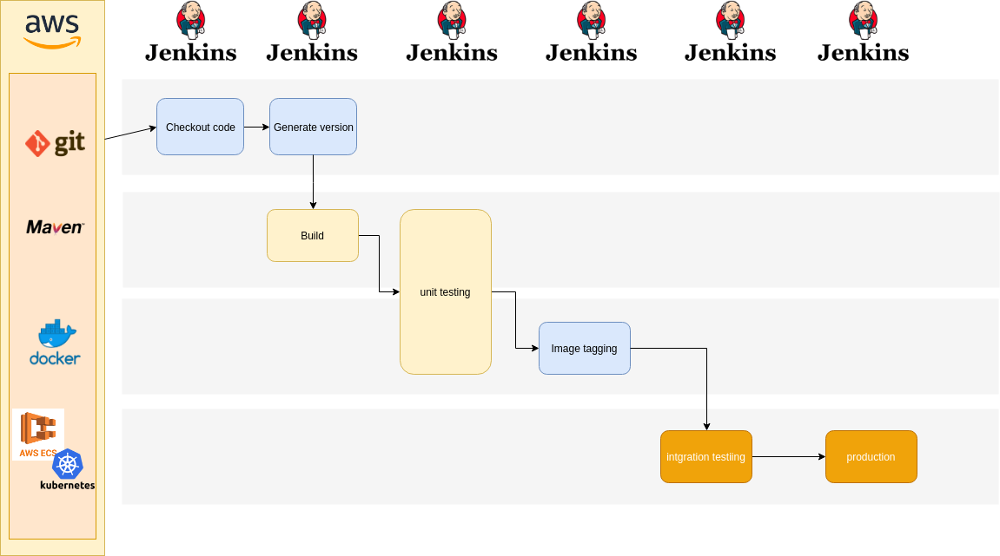

# Adidas Coding Challenge

## Subscription Service

The scenario consists of a public service where people can subscribe for receiving newsletters, on a public API. It consists of 3 microservices, where only the public api is exposed.

Due to the lower SLA for the public service, it doesn't wait fot the subscription service to persist the data. Instead, it sends the message saying that a new subscriber is here and then the subscrition service takes the message and persists the data at its pace. Once it does, another message is sent, freeing it for new data persisting. This time for the email service takes the new message from the kafka topic to send email confirmations to the user.

## Tecnologies

* Spring boot for fast java development. It has implementations for everything in J2EE plus integrations with a lot open source tools like kafka, used in this project
* Kafka for horizontally scalable data sharing. Here use in a form of messaging sharing
* Sprinfox and Swagger for api documentation
* Postgresql with flyway for database schema update manager
* Docker for application containerization and isolation. "only public service is accessible from the end user", so only this service is exposed in the outter network

## Pipeline proposal

## Running
  make build-run-all. For next spin ups, make just-run

## Docs
http://localhost:8080/swagger-ui.html
